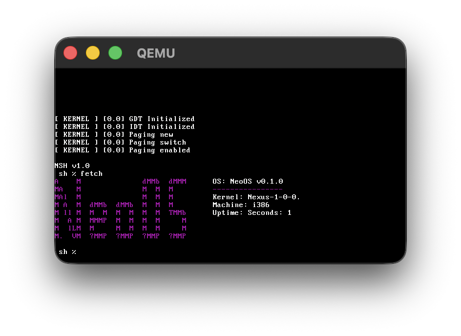

# NeoOS
A 32-bit hobby Operating System for the x86 architecture.

## Features
Currently implemented:
* 32-bit x86 kernel
* Filesystem support, FAT16 and NeoFS
* RAM-only filesystem
* A basic shell with a set of command
* Multiple programs runnable from the shell
* Security features inspired from Open BSD



### The shell

The neo shell (`nsh`) is a basic implementation of a shell. The standard commands are not UNIX-compatible, but some are documented in [commands.md](commands.md).

### NeoOS standard C library

NeoOS provides a standard C library with APIs and headers files that are pretty similar to those found in conventional C enviroments. NeoOS also provides some kernel-specific interractions and security features which are documented in [c.md](c.md).

For more advanced programs needing more control over the terminal the NeoOS implementation of ncurses `curses` can be used. It is simple to use. A brief explanation can be found in [curses.md](curses.md).

## Testing NeoOS

> **NOTE** NeoOS is not a OS intended to be used on real hardware and recommands being run in a vm. NeoOS may run on some x86 cpu but it has not been tested yet.

First, make sure QEMU is installed. The package name may differ depending on your operating system:

- Brew: `brew install qemu`
- Apt: `apt install qemu-system-x86`
- Dnf: `dnf install qemu-system-x86`
- Pacman: `pacman -S qemu-system-x86`

### Running

If you already have `kernel.elf` and `disk.img`, place them in the same directory and run:

```bash
qemu-system-i386 -kernel kernel.elf -hda disk.img
```
If the command is unavailable try:
```bash
qemu-system-x86_64 -kernel kernel.elf -hda disk.img
```
or:
```bash
qemu-system-x86 -kernel kernel.elf -hda disk.img
```

## The Nexus kernel

Nexus is a single core multi-threadded kernel written for the 32-bit x86 architecture (i386). The kernel includes drivers needed for basic system interraction like disk/filesystem interraction, keyboard input and text output.

## How it works

At the start of the computer/virtual machine the kernel is the first thing loaded and executed. The kernel sets up memory and drivers before reading a disk and executing the first program. The first process in this case is the init, that then creates a fork that is the shell which later executes more programs. 

This results in a tree of processes all coming from the init:
<pre>
init
  └── nsh
       ├── program
       ├── program
       └── program
</pre>